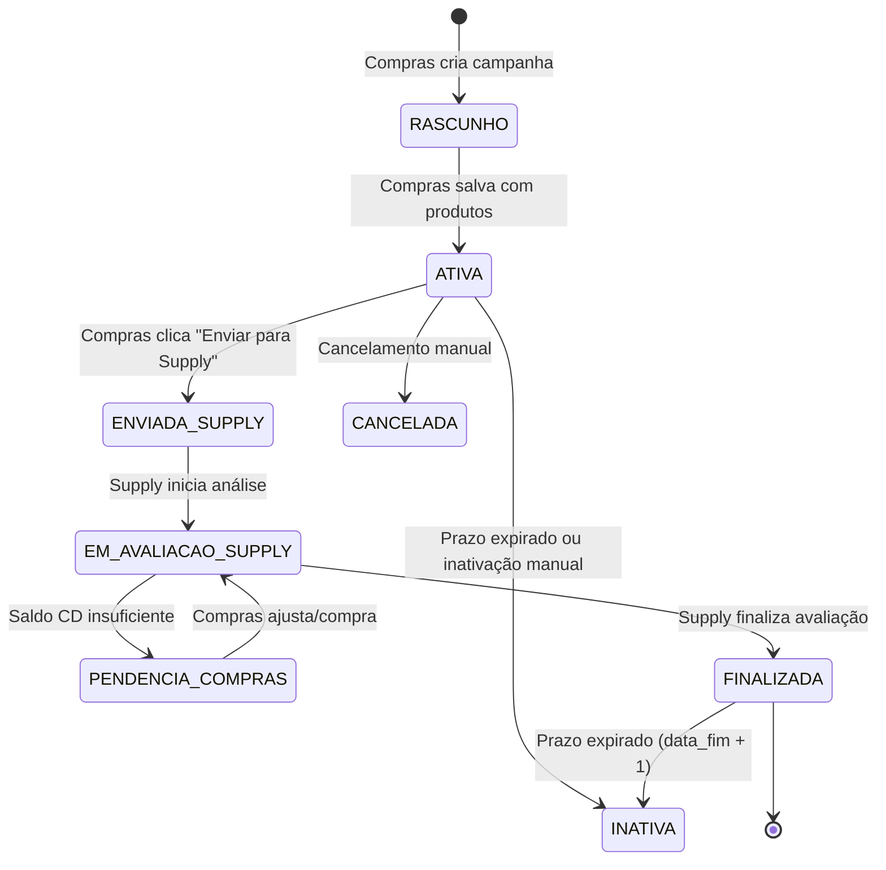

# 02 - ESPECIFICAÇÃO DE TELAS, INTERFACES E FLUXOS

Este documento descreve detalhadamente o comportamento, componentes de interface (Streamlit), validações e fluxos de tela para as 3 páginas principais do módulo.

---

## 🧭 Diagrama de Estados da Campanha

---

## 🖥️ PÁGINA A — Compras: Criação e Gestão de Campanhas (`page/campanhas_compras.py`)

### 1. Perfis com Acesso
- Usuários com `cargo IN ('compras', 'comprador')` ou `role == 'admin'`.

### 2. Seção Superior: Capa da Campanha
- **Radio / Abas:** `[➕ Nova Campanha]` | `[📂 Campanhas Existentes]` | `[📋 Devolutivas do Supply]`.
- **Campos Nova Campanha:**
  - **Nome da Campanha:** `st.text_input` (Obrigatório, ex: "Festival de Bebidas Outubro 2026").
  - **Período de Vigência:** `st.date_input` (Data Início e Data Fim).
  - **Gerador de Código:** Ao salvar, gera automaticamente o código único legível `CMP-2026-XXXXXX`.
- **Ações na Campanha Ativa:**
  - **Botão "💾 Salvar Rascunho / Atualizar":** Grava dados em `campanhas`, `campanha_itens` e `campanha_lojas`.
  - **Botão "⏸️ Inativar Campanha":** Muda status para `INATIVA` caso a negociação com o fornecedor seja suspensa.
  - **Botão "🔄 Replicar Campanha":** Clona a estrutura inteira com novo ID único, vincula `campanha_origem_id` e força o comprador a informar o novo período de vigência.
  - **Botão "🚀 Enviar para Supply":** Valida se todos os itens possuem tipo de exposição definido e altera o status para `ENVIADA_SUPPLY`.

### 3. Seção Intermediária: Busca de Produtos no Parquet
- **Campo de Busca:** `st.text_input` com busca incremental por Código Consinco ou Descrição no `query.parquet`.
- **Card Resumo do Produto Selecionado:**
  - `Descrição Snapshot`
  - `Estoque Total Lojas` (soma das 14 lojas) | `Estoque CD15` (saldo do CD)
  - `Venda Média Diária Consolidada` | `Venda Projetada no Período`
  - `Embalagem de Compra` | `Embalagem de Transferência`

### 4. Seção Inferior: Matriz de Lojas (14 Lojas Operacionais)
- **Tabela / DataEditor para as lojas (001 a 008, 011 a 014, 017, 018):**
  - **Loja:** Código e Nome.
  - **Exposição:** `SelectBox` (Ponta de Gôndola, Meia Ponta, Ilha, Orelha).
  - **Estoque Loja Atual:** Exibido em tempo real do parquet.
  - **Venda Média Loja:** Venda diária calculada (`QTD_VENDIDA_30D / 30`).
  - **Venda Projetada Loja:** `venda_media * dias_campanha`.
  - **Volume Sugerido Comprador (unidades):** `st.number_input` opcional (pode ficar zerado ou nulo, transferindo a decisão de volume para a equipe de Supply).

### 5. Seção de Devolutivas de Compras
- Tabela com os produtos que o Supply apontou falta de saldo no CD15:
  - `Código` | `Produto` | `Caixas Necessárias` | `Estoque Disponível CD` | `Caixas Faltantes para Compra` | `Status (Pendente/Resolvido)`.

---

## 🏪 PÁGINA B — Loja: Visualização Operacional da Própria Loja (`page/campanhas_loja.py`)

### 1. Perfis com Acesso
- Usuários autenticados que possuam vínculo com lojas (`st.session_state["lojas_acesso"]`).

### 2. Segurança e Restrições Rígidas
- **Filtro Rígido no SQL:** O usuário **nunca** recebe registros de lojas não autorizadas.
- **Campos Ocultados da Loja:** Estoques de CDs, estoques de outras lojas, cálculos internos de cubagem, volumes sugeridos originais de compras e margens.
- **Vigência:** Só aparecem campanhas ativas e dentro da data de vigência (`data_fim >= data_atual`).

### 3. Exibição Visual
- **Cabeçalho:** Identificação da Loja (ex: `Loja 004 - Bagé`).
- **Cards de Campanhas Vigentes:**
  - Nome da Campanha e Vigência (ex: *De 01/10/2026 até 15/10/2026*).
  - Tabela de Itens da Loja:
    - `Código Produto`
    - `Descrição`
    - `Tipo de Exposição` (ex: Ponta de Gôndola)
    - `Volume Final Aprovado (Unidades)`
    - `Caixas a Receber`
- **Botões de Exportação:**
  - `📄 Baixar PDF da Campanha` (layout pronto para prancheta de loja).
  - `📊 Baixar Planilha Excel (.xlsx)` (consulta simplificada).
  - `🖨️ Imprimir Visualização`.

---

## 📦 PÁGINA C — Supply: Avaliação, Cubagem e Fechamento (`page/campanhas_supply.py`)

### 1. Perfis com Acesso
- Usuários com `cargo IN ('supply', 'abastecimento')` ou `role == 'admin'`.

### 2. Seção Superior: Seletor de Campanhas em Avaliação
- Filtra campanhas com status `ENVIADA_SUPPLY` ou `EM_AVALIACAO_SUPPLY`.
- Indicador de progresso: `Itens Avaliados: X de Y (Z% concluído)`.

### 3. Seção 1: Cadastro e Leitura de Dimensões Físicas do SKU
- Exibe o produto selecionado.
- Se o produto já possui medidas em `produto_dimensoes`, pré-carrega automaticamente:
  - **Altura (cm):** `st.number_input`
  - **Largura (cm):** `st.number_input`
  - **Profundidade (cm):** `st.number_input`
- Botão para salvar/atualizar as dimensões físicas no banco.

### 4. Seção 2: Parametrização de Exposição e Cubagem por Bandeja
- **Estrutura Física:** Seleção do modelo (ex: *Ponta de Gôndola Modelo A - 6 bandejas*).
- **Número de SKUs Compartilhados:** `st.number_input` (ex: 3 sabores).
- **Cálculo Automático em Tempo Real:**
  - O sistema calcula a capacidade física de cada uma das bandejas da estrutura e faz o rateio por SKU.
  - Exibe a **Capacidade Total Física da Exposição para o SKU**.

### 5. Seção 3: Análise Loja a Loja e Fechamento de Volume
- **Grid de Fechamento por Loja:**
  - `Loja`
  - `Exposição`
  - `Estoque Atual Loja`
  - `Venda Projetada`
  - `Sugestão Comprador`
  - `Sugestão Cubagem Calculada`
  - `Volume Final Supply (Input Editável)`
  - `Embalagem Transferência`
  - `Caixas Calculadas` $= \lceil \text{Volume Final} / \text{Embalagem} \rceil$
  - `Volume Efetivo Transferido` $= \text{Caixas} \times \text{Embalagem}$

### 6. Seção 4: Conferência de Estoque CD15 e Devolutivas
- Confronta as caixas totais necessárias de todas as 14 lojas com o saldo disponível no CD15 (`QUANTIDADE_DISPONIVEL` do parquet):
  - **Cenário 1 (Estoque Suficiente):** Marca `status_estoque = 'OK'`, transfere 100%.
  - **Cenário 2 (Estoque Parcial):** Marca `status_estoque = 'PARCIAL'`, define transferências possíveis e gera saldo devedor em `campanha_devolutivas`.
  - **Cenário 3 (Estoque Zerado no CD):** Marca `status_estoque = 'SEM_ESTOQUE_CD'`, transfere 0 caixas e envia 100% da necessidade para compra na devolutiva.

### 7. Seção 5: Resumo e Exportações Operacionais
- **Card Resumo de Fechamento:**
  - Total de Caixas de Transferência: `XXX cx`.
  - Total de Caixas para Compra: `YY cx`.
  - Pendências restantes: `0` (Bloqueia finalização se houver itens sem avaliação).
- **Botões Finais:**
  - **"✅ Finalizar Avaliação da Campanha":** Altera status para `FINALIZADA`.
  - **"📥 Gerar Excel Operacional para Lançamento":** Gera arquivo `.xlsx` pronto para digitação no ERP Consinco.
  - **"📑 Gerar Excel Devolutiva Compras":** Gera arquivo `.xlsx` com o relatório de compras necessárias.
